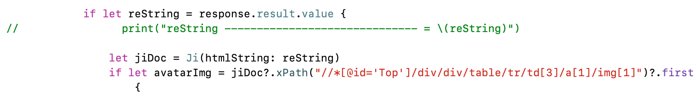
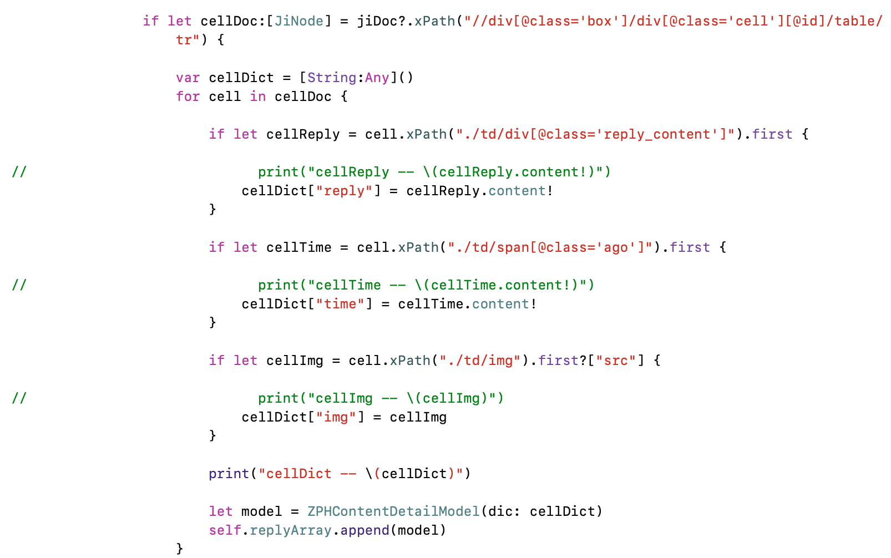

pid: 190202;

tag: iOS, Swift;

---

## Swift-使用Ji

[Ji(戟)](https://github.com/honghaoz/Ji)是一个Swift版的XML/HTML解析器

最近在做一个关于V2EX的app,上面的接口已经不能满足完全的开发需求,所以请求了HTML的版本.

获取到``id="top"``中td数组中下标为3的/a数组中下标为1/img数组中下边为1的内容

外面的表示``div的class=box并且有style的内容``,headtitle为``./div/h1``中,``debugDescription``的是带标签的内容.

``content``是去掉标签的内容