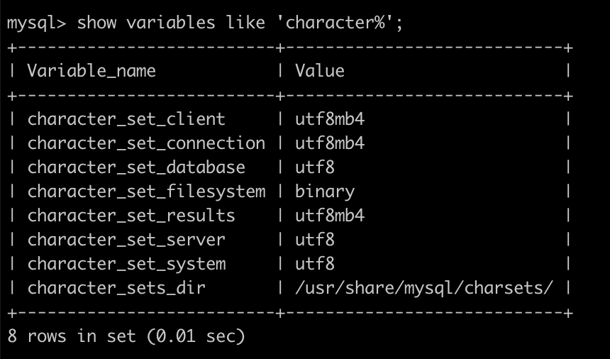
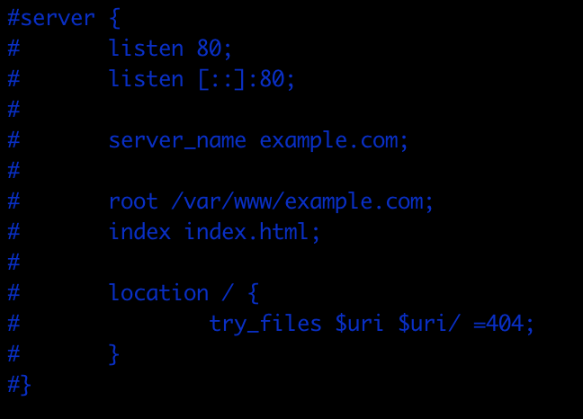
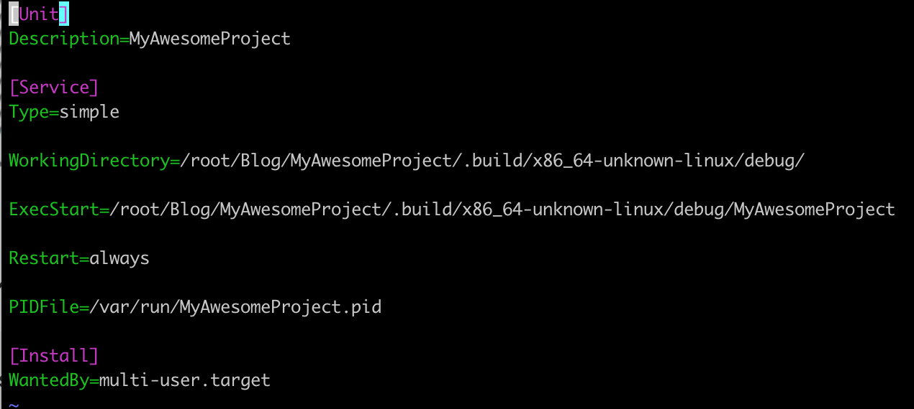

pid: 190127;

tag: Swift;


---


## Swift-使用Perfect搭建博客页面


前段时间听说swift5的改变之一是ABI稳定,现在看的话,swift是值得学习的,于是想通过搭建自己的博客来学习swift,顺便了解后端和mysql,以及前端页面的一些样式.

博客项目放在了[github](https://github.com/semperhhh/MyAwesomeProject),喜欢的可以点赞.


### Perfect

在swift作为语言基础的前提下,选择了Perfect框架,Perfect网站上有详细的文档和用例,前期可以先参考[Perfect-Blog-Mustache](https://github.com/PerfectExamples/Perfect-Blog-Mustache),这是一个非常简单的blog框架.Perfect文档详细介绍了每个功能模块的用法,需要注意的是*HTTP路由*,这是我们会经常用到的库


### 云服务器和mysql

当启动PerfectHttp服务器后,通过访问``127.0.0.1:端口``,就可以看到我们设置的index.html页面,通过在*HTTP路由*中设置的``url``我们可以访问对应的路径,得到对应的页面,这里的页面应该是一个静态页面,是固定不会变化的.我们可以在服务器中安装mysql作为数据提供,也可以在本机安装mysql.

我的服务器安装了ubuntu14.0和mysql5.7,以及swift4.2.

将项目放到github上托管,在终端使用ssh远程连接云服务器,使用``git clone``拉取项目,然后``swift build``,正常情况下会开启我们的http服务.

> 这里有点要注意的,在server的路径,我们尽量使用绝对路径,我在搭建的过程中因为路径的事绕了很多圈子

在项目中声明``import PerfectMySQL``,就可以连接我们的数据库,我们可以在每次访问blog文章列表的时候都读取数据库.

> 同样要注意的是数据库的编码格式和字符集,不是utf8可能会导致数据库中的中文变成??
>
> 也要注意连接数据库和ubuntu的编码,不然可能在服务器中读取不到中文




### nginx反向代理

在我们可以通过http://ip+端口访问到我们的页面后,我们需要的可能就是一个代替ip的域名,将域名解析为我们的ip地址,但是这样只能让域名访问默认的80端口,如果我们使用的是8181端口,就需要设置nginx反向代理






### mustache页面模板

我们的页面虽然有个数据库的支持,但是还是不能按照数据库的条数完全展示,现在我们可以利用mustache模板对前端html页面进行调整,需要在项目中引用``import PerfectMustache``


### buttons和bootstrap

web页面的样式是比较复杂的,想要美观和实用,需要的时间就很多,但是有一些大神已经帮我铺好了路,造好了轮子,例如一些常见的button,在[buttons](http://www.bootcss.com/p/buttons/)上可以快速应用到我们的页面上.

但是整个界面的布局以及在移动端上的显示,仅仅是控件还是不够的,于是我引用了``bootstrap``作为全段界面的主要布局,其中的栅栏布局很实用


### markdown转html的两种方案

我们在编写文章时常用markdown格式,在Perfect里也有markdown转html的库,通过引用可以非常简单的实现转换,但是在什么时候转换,大概有两种方案:

* 在列表中点击链接时,在网页请求时进行转换,这样可以不用生成对应的html文件
* 提前将所有的md转化成对应的html,生成所有的html文件

这两种方法都有各自的优缺点,选择一种就可以


### 简单的shell脚本

通过一些简单的shell和expect命令,我们在每次登陆是都可以不用输入麻烦的ip和密码操作,以及其他一些小操作

```shell
spawn scp -r $localFile $user@$host:$targetPath
 expect "*password:"
 send "$password\r"
 interact
```


### 参考

[官网例子](https://www.perfect.org/tutorials.html)

[Calatrava](https://github.com/enums/Calatrava)

[Swift语言开发App服务端](https://www.jianshu.com/p/dcc6bbc54bde)

[Swift Perfect - 使用 systemd 命令服务器](https://www.jianshu.com/p/d5e7fc5be2fb)

[使用Supervisor让你的Swift服务器项目后台运行](https://www.jianshu.com/p/a35639b3b389)

[Swift + Perfect开发你的服务器(高级版)](https://www.jianshu.com/p/a63d23fc8614)

