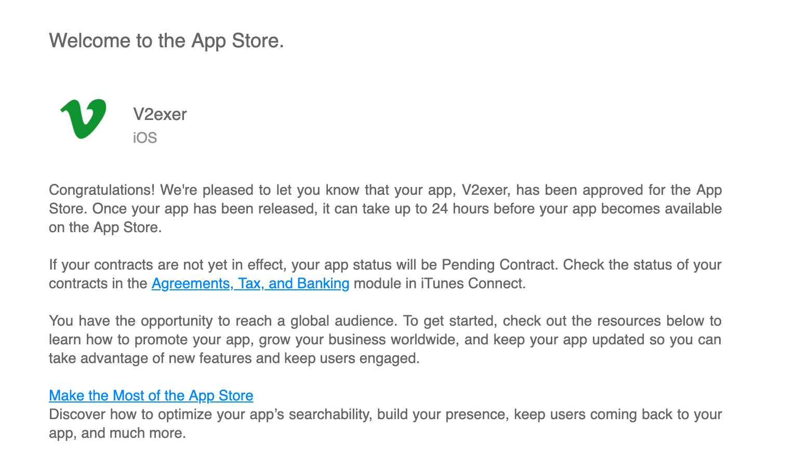
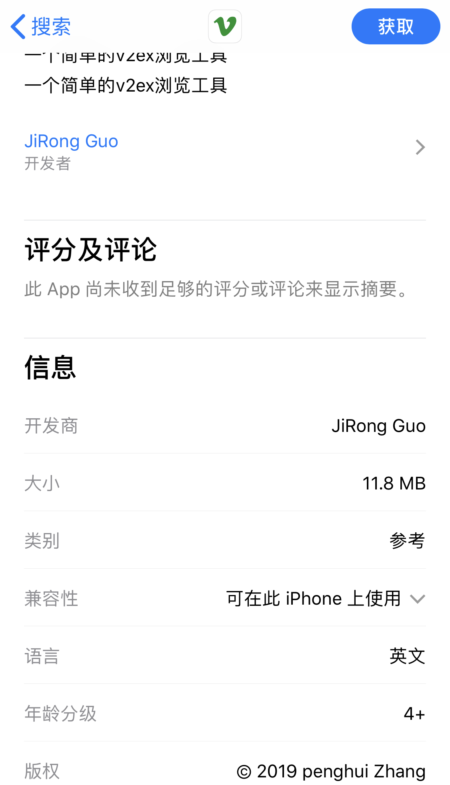
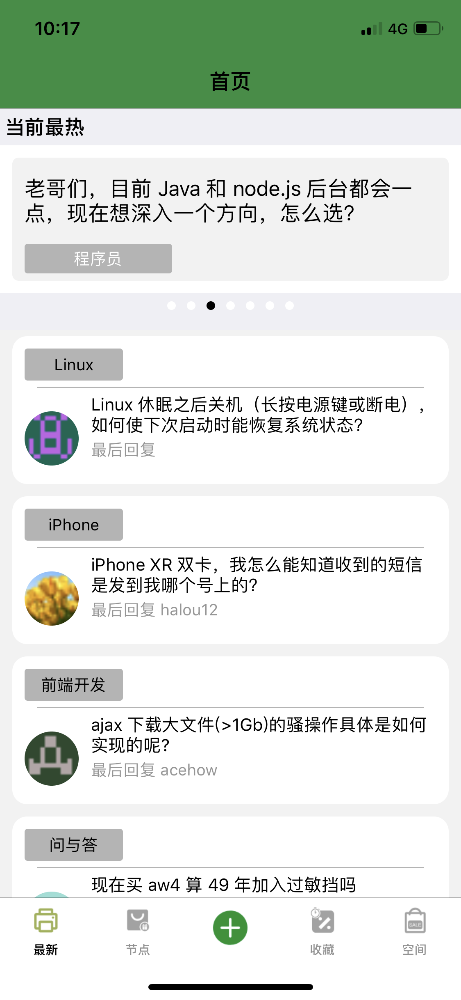
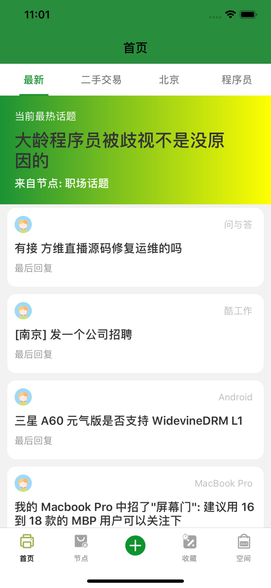

pid: 190615;

tag: iOS;

---

# V2exer上线啦!

v2exer的README创建日期是18年12月,到今天成功上线经过了6个月.

今天终于收到了苹果爸爸的邮件嘻嘻嘻~

  
  

v2exer的首页改版4次

  
  

因为第一次提审核是2.1被拒,提示和网页web内容相似,所以着重修改了首页.

V2exer是12月在家宅的时候,想学习swift,找工作可以向swift方向发展,但是上份工作不理想,完全没有提高,所以自己开项目.先是开始用swift做这个博客后台,但是css和html水平还没入门,博客的效果不是很理想,而且进度很慢,一个问题常常需要查很多资料,耗很多时间才能解决,主要原因还是国内的博客都是复制粘贴的,真正解决问题的很少.

V2exer项目很小,主要获取数据方法相当于爬虫,使用swift的开源框架JI获取数据解析,现在只是简单的展示数据.

第一个项目上线了,即时他很烂,但也算是独立开发要入门了, 不管这个app后面是继续维护迭代,还是卖了,都是历史的一大步.

激动激动

