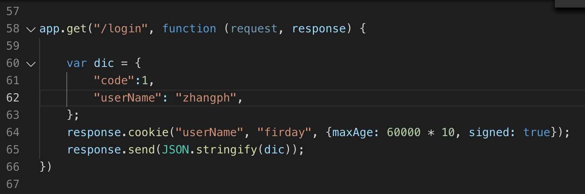
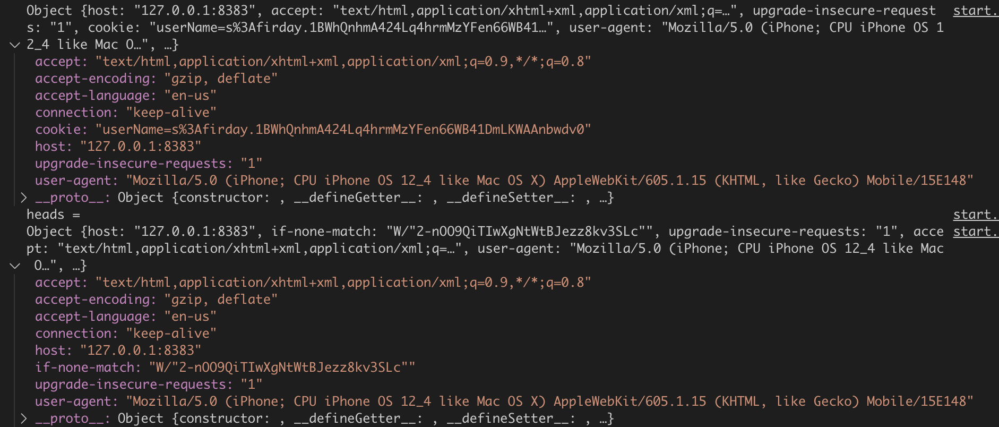

### WKWebView了解

---


使用模拟器打开WKwebview的请求头:

> Mozilla/5.0 (iPhone; CPU iPhone OS 12_4 like Mac OS X) AppleWebKit/605.1.15 (KHTML, like Gecko) Mobile/15E148


使用mac打开网页的请求头: 

> Mozilla/5.0 (Macintosh; Intel Mac OS X 10_14_4) AppleWebKit/537.36 (KHTML, like Gecko) Chrome/76.0.3809.132 Safari/537.36


#### cookie同步问题




模拟从native登陆并注入cookies




上面有cookie的是通过UIWebView加载的,下面没有的是通过WKWebView加载的.

> 通过native的登录获取的cookie信息使用NSHTTPCookieStorage存到了本地,在wkwebview加载的时候并不会获取到,所以一些在native登陆,再通过wkwebview是获取不到登陆状态的.这著名的**首次 WKWebView 请求不携带 Cookie 的问题**
>
> 但是在wkwebview中注入的cookie,在同域名的wkwebview是可以获取到的.是因为JS 执行 document.cookie 或服务器 set-cookie 注入的 Cookie 会很快同步到 NSHTTPCookieStorage 中.


其实，iOS11 可以解决*首次 WKWebView 请求不携带 Cookie 的问题*，**只要是存在 WKHTTPCookieStore 里的 cookie，WKWebView 每次请求都会携带**.


#### wkwebview的cookie注入

拼接Cookies的方式:

WKWebview的cookies是webkit的,和``NSHTTPCookieStorage``不是同步的,所以在加载网页的时候要拼接上去.

```objective-c
NSMutableURLRequest *request = [NSMutableURLRequest requestWithURL:url];
NSArray *cookies = [[NSHTTPCookieStorage sharedHTTPCookieStorage] cookies];
NSDictionary *dict = [NSHTTPCookie requestHeaderFieldsWithCookies:cookies];
request.allHTTPHeaderFields = dict;
[self.wkWebView loadRequest:request];
```

同样为了解决跨域问题，在代理中每次跳转之前拼接Cookies.


#### ajax body 丢失(post请求body数据被清空)

WKWebView在独立于app进程之外的进程中执行网络请求,请求数据不经过主进程，因此，在 WKWebView 上直接使用 NSURLProtocol 无法拦截请求.

通过注册 http(s) scheme 后 WKWebView 将可以使用 NSURLProtocol 拦截 http(s) 请求.

由于 WKWebView 在独立进程里执行网络请求。一旦注册 http(s) scheme 后，网络请求将从 Network Process 发送到 App Process，这样 NSURLProtocol 才能拦截网络请求。在 webkit2 的设计里使用 MessageQueue 进行进程之间的通信，Network Process 会将请求 encode 成一个 Message,然后通过 IPC 发送给 App Process。出于性能的原因，encode 的时候 HTTPBody 和 HTTPBodyStream 这两个字段被丢弃掉了

因此通过`` registerSchemeForCustomProtocol ``注册了 http(s) scheme, 那么由 WKWebView 发起的所有 http(s)请求都会通过 IPC 传给主进程 NSURLProtocol 处理，导致 post 请求 body 被清空.

(来源[WKWebView那些坑](https://mp.weixin.qq.com/s/rhYKLIbXOsUJC_n6dt9UfA))


