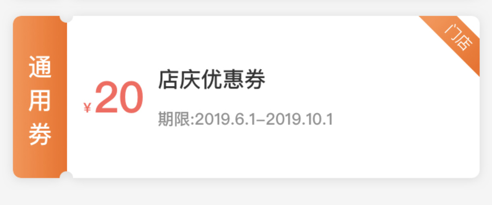

pid: 190604;

tag: iOS;

------


## iOS-UIBezierPath画图形

> 目标是画出一个带阴影的圆角图片



在layer的实际使用中,layer加了圆角后就不可以加阴影了,因为圆角的裁剪出来的,view被裁剪的时候就把阴影的部分裁掉了.

简单的实现办法:两个view,下面的负责阴影,上面的负责圆角.

先看圆角:

```objective-c
//写到drawrect里,重画图形
- (void)drawRect:(CGRect)rect {
    // Drawing code
    
    UIBezierPath *path = [[UIBezierPath alloc]init];
    CGFloat pathRadius = 6;
    CGFloat pathleft = 34;
    
    //左
    [path moveToPoint:CGPointMake(0, pathRadius)];
    [path addLineToPoint:CGPointMake(0, self.bounds.size.height - pathRadius)];
    
    //左下圆角
    [path addArcWithCenter:CGPointMake(pathRadius, self.bounds.size.height - pathRadius) radius:pathRadius startAngle:M_PI endAngle:M_PI_2 clockwise:false];
    //下左
    [path addLineToPoint:CGPointMake(pathleft, self.bounds.size.height)];
    
    //下圆
    [path addArcWithCenter:CGPointMake(pathRadius + pathleft, self.bounds.size.height) radius:pathRadius startAngle:M_PI endAngle:0 clockwise:true];
    
    //下右
    [path addLineToPoint:CGPointMake(self.bounds.size.width - pathRadius, self.bounds.size.height)];
    
    //下右圆角
    [path addArcWithCenter:CGPointMake(self.bounds.size.width - pathRadius, self.bounds.size.height - pathRadius) radius:pathRadius startAngle:M_PI_2 endAngle:0 clockwise:false];
    
    //右
    [path addLineToPoint:CGPointMake(self.bounds.size.width, pathRadius)];
    
    //右上圆角
    [path addArcWithCenter:CGPointMake(self.bounds.size.width - pathRadius, pathRadius) radius:pathRadius startAngle:0 endAngle:-M_PI_2 clockwise:false];
    
    //上右
    [path addLineToPoint:CGPointMake(pathRadius * 2 + pathleft, 0)];
    
    //上圆
    [path addArcWithCenter:CGPointMake(pathRadius + pathleft, 0) radius:pathRadius startAngle:0 endAngle:M_PI clockwise:true];
    
    //上左
    [path addLineToPoint:CGPointMake(pathRadius, 0)];
    
    //上左圆角
    [path addArcWithCenter:CGPointMake(pathRadius, pathRadius) radius:pathRadius startAngle:-M_PI_2 endAngle:-M_PI clockwise:false];
    
    CAShapeLayer *shape = [[CAShapeLayer alloc]init];//形状
    shape.path = path.CGPath;//添加路径
    
    self.layer.mask = shape;//layer遮罩,遮罩就是只显示遮罩内的部分.
}

```

再看阴影:

```objective-c
  	//前面和画圆角的一样.但是圆角要大一点,这个view要小一点,不然会有黑边
		CAShapeLayer *shape = [[CAShapeLayer alloc]init];
    shape.path = path.CGPath;
    shape.shadowOpacity = 1;
    shape.shadowColor = [UIColor colorWithWhite:0.1 alpha:0.3].CGColor;
    shape.shadowOffset = CGSizeMake(1, 1);
    
    [self.layer addSublayer:shape];
```

这两个view叠起来就是上图的效果.
