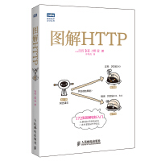

pid: 19030601;

tag: 计算机基础;

------

# 《图解HTTP》学习笔记

过年在家期间读了这本``图解HTTP``,对于http原理,web及网络基础有了很多新的认识和了解.

#### HTTP/1.0

1996年的5月正式作为标准被公布的HTTP/1.0,该协议标准至今仍被广泛使用在服务器端.

#### HTTP/1.1

1997年1月公布的HTTP/1.1是目前主流的http协议版本.

### TCP/IP协议族

计算机与网络设备要相互通信,双方就必须基于相同的方法.不同的硬件,操作系统之间的通信,所有的这一切都需要一种规则.我们就把这种规则称为协议(protocol).

我们把与互联网相关联的协议集合起来总称为TCP/IP.

TCP/IP协议族按层次分为4层:

* 应用层 :决定了想用户提供应用服务时通信的活动.比如``FTP``和``DNS服务``,``HTTP协议``也处于该层.
* 传输层 :传输层对上层应用层,提供处于网络连接中的两台计算机之间的数据传输.传输层有两种协议:``TCP(传输控制协议)``和``UDP(用户数据报协议)``
* 网络层 :用来处理在网络上流动的数据包.数据包是网络传输的最小数据单位.在进行传输时,网络层所起的作用就是在众多的选项内选择一条传输路线.``IP(网际协议)``位于网络层.
* 数据链路层 :用来处理连接网络的硬件部分.

IP协议作用是把各种数据包传送给对方,两个重要条件:

* ``IP地址`` :指明了节点被分配到的地址. 可变换.
* ``MAC地址`` :指网咖所属的固定地址. 基本上不会更改.

#### 确保可靠性的TCP协议

TCP位于传输层,提供可靠的字节流服务:

> 字节流服务指,为了方便传输,将大块数据分割成以报文段为单位的数据包进行管理.

确保数据能到达目标,TCP协议采用了``三次握手策略``.

#### 域名解析的DNS服务

DNS提供域名到IP地址之间的解析服务.

DNS协议提供通过域名查找IP地址,或逆向从IP地址反差域名的服务.如``nginx``的反向代理.

#### URI和URL

URI(统一资源标识符),URL(统一资源定位符).URL是URI的子集.

---

### HTTP是不保存状态的协议

HTTP协议资深不对请求和响应之间的通信状态进行保存,也就是说协议对于发送过的请求或响应都不做持久化处理.

为了保存用户的状态,引入了Cookie技术.

cookie会根据从服务器端发送的响应报文内的一个叫做set-cookie的首部字段信息,通知客户端保存cookie.当下次客户端再往该服务器发送请求时,客户端会自动在请求报文中加入cookie值后发送出去.

### HTTP返回结果的状态码

|      | 类别                          | 原因短语                   |
| ---- | ----------------------------- | -------------------------- |
| 1xx  | informational(信息性状态码)   | 接收的请求正在处理         |
| 2xx  | success(成功状态码)           | 请求正常处理完毕           |
| 3xx  | redirection(重定向状态码)     | 需要进行附加操作以完成请求 |
| 4xx  | clientError(客户端错误状态码) | 服务器无法处理请求         |
| 5xx  | serverError(服务端错误状态码) | 服务器处理请求出错         |

### HTTP首部

---

### 确保web安全的HTTPS

http的不足:

* 通信使用明文,内容可能会被窃听

* 不验证通信方的身份,因此有可能遭遇伪装

* 无法证明报文的完整性,所以有可能已遭篡改

**通信的加密**: HTTP协议中没有加密机制,但可以通过和SSL(安全套接层)或TLS(安全层传输协议)的组合使用,加密HTTP的通信内容.与SSL组合使用的HTTP被称为HTTPS(超文本传输安全协议).

**查明对手的证书**: SSL不仅提供加密处理,而且还使用一种被称为证书的手段,可用于确定方.

证书由值得信任的第三方机构颁发,用以证明服务器和客户端是实际存在的.

## HTTP + 加密 + 认证 + 完整性保护 = HTTPS

HTTPS是身披SSL外壳的HTTP.

---

## HTTPS采用混合加密机制

SSL采用一种叫做公开密钥加密的加密处理方式.

``对称加密(共享密钥加密)``:一个私有密钥.

``非对称加密(公开密钥加密)``:一个私有密钥和一个公开密钥.

> 证书

可证明组织真实性的EV SSL 证书.

由自认证机构颁发的证书称为自签名证书.

## WebSocket的设计与功能

WebSocket,即Web浏览器与Web服务器之间全双工通信标准.是建立在HTTP基础上的协议,因此连接的发起方仍是客户端,而一旦确立WebSocket通信连接,不论服务器还是客户端,任意一方都可直接向对方发送报文.