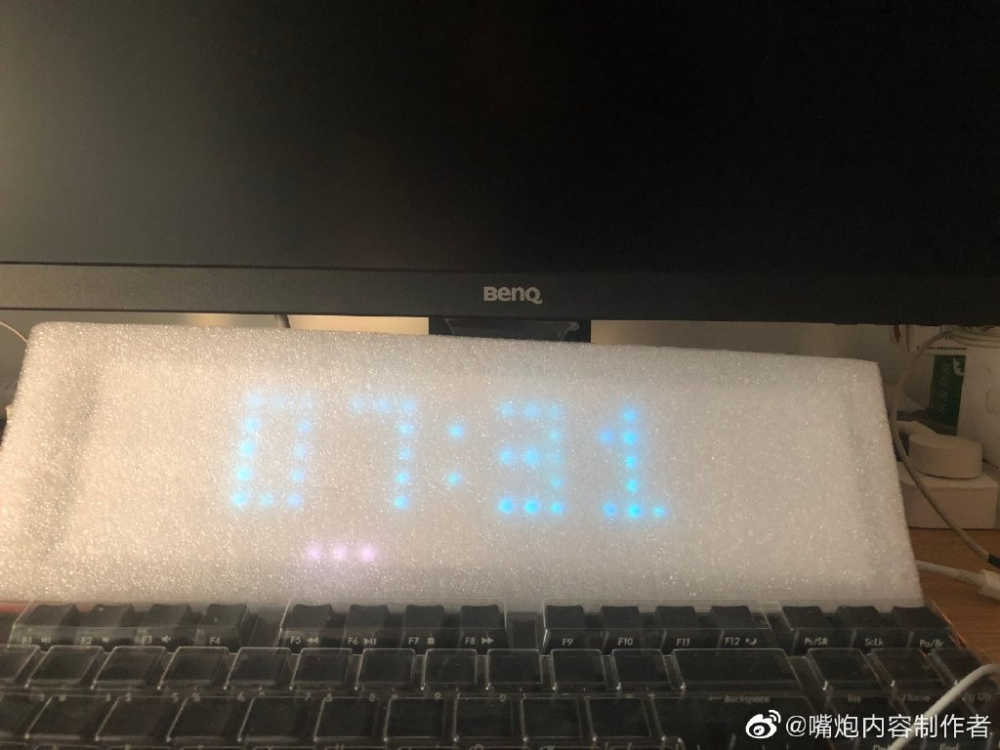

## 动手制作一个wifi时钟

少数派文章地址:

[如何制作一个 WIFI 像素时钟，只要Lametric十分之一的价格](https://sspai.com/post/54225?from=weibo)

#### 准备

按照文章的内容购买了

- WS2812B 全彩 8*32 全彩可编程像素软屏
- ESP8266 WIFI 模块 CP2102 ESP-12E
- 杜邦线 公对母

这三个是必需的,3d打印光栅是不影响点亮的.

####  服务端

有个最低配的ubuntu的阿里云服务器,可以保证24小时不停机.

按照文章的命令操作即可.

需要注意的是要打开阿里云服务器的安全组端口**7000**和**7001**这两个,不然连不上wifi模块

#### 客户端固件

VSCode完全可以,一键刷机.

在填写awtrix-conf.h文件的时候,wifi填写正确时,当脸上屏幕后会显示``wifi...`` 然后``ready``.代表wifi连接上了,但是没连接到服务端.

wifi正确,服务端连接争取,则成功出现时钟.

``awtrix_server``只需要填写服务端的ip地址就行,也不用加``http`` 和端口.

