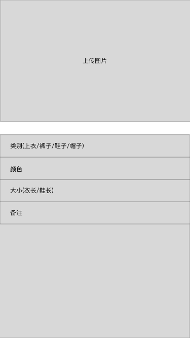
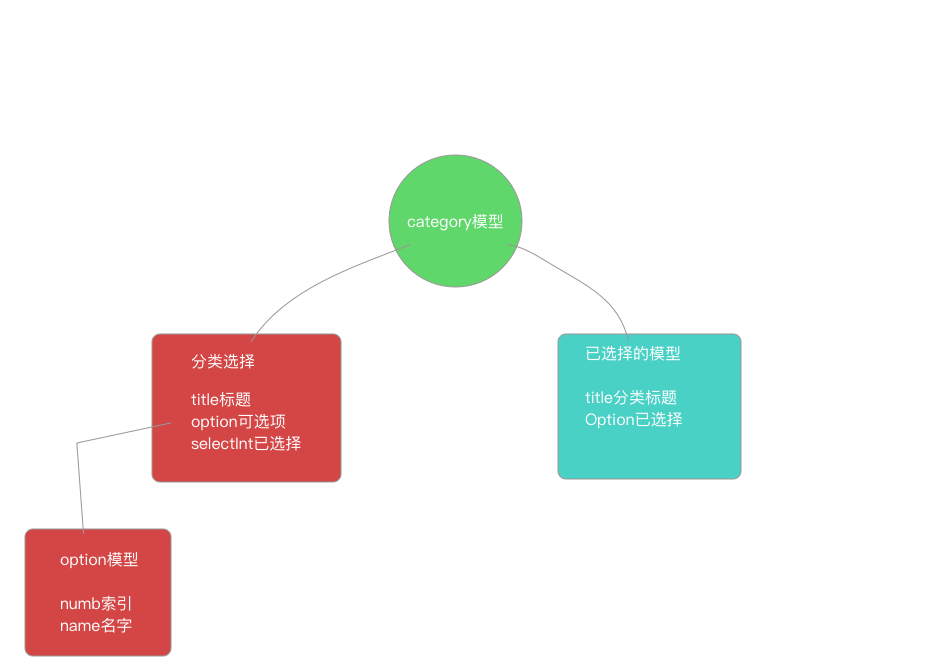

# 独立开发一款衣橱app

> 独立开发一款衣橱app

双十一买衣服,发现很多衣服的尺寸不是标准的, 或者不明确自己的尺寸是多少, 基于这个原因,开发一款记录自己衣服尺寸的app,同时可以记录自己的一些常穿的衣服方便换季搭配.

上传衣服的界面

* 上传衣服图片

* 衣服类型

* 颜色

* 大小

* 自定义的内容

  

#### UI界面搭建

原意是想学习SwiftUI和新的api``UICollectionViewCompositionalLayout``, 但是一方面是不成熟, 搞不清item和group的约束,另一个是api的文档读不懂,无法做到像大牛们那样轻松的自定义UI搭建,所以..还是tableview和collectionview嵌套.

``UICollectionViewCompositionalLayout``的布局方式和``flutter``的意思是有些相似的,简单和直接.

#### model模型定义

